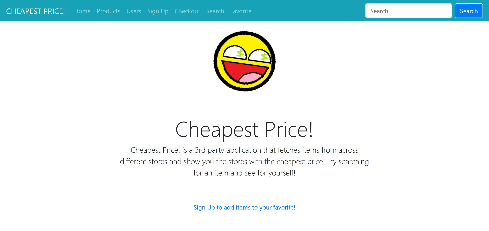

# Cheapest Price App

**This app was designed to search through a database of upc/barcodes and determine which of the user searched products is the cheapest. The api and database used to fetch the data can be found here:  [UPC](https://www.barcodelookup.com/)**




## Installing

In order to run this locally, you need to do the following...

 1. Clone the repo `$ git clone https://github.com/drockchow112/Capstone-FrontEnd.git`
 2. Clone the repo `$ git clone https://github.com/drockchow112/Capstone-TTP-BackEnd.git`
 3. Be sure to checkout our backend repo before running the frontend

Using npm install to obtain dependencies.

```bash
$ npm install
```
Once dependencies are setup its time to start our App.

```bash
$ npm start
```
## Contributing

Pull requests are welcome. For major changes, please open an issue first to discuss what you would like to change.
